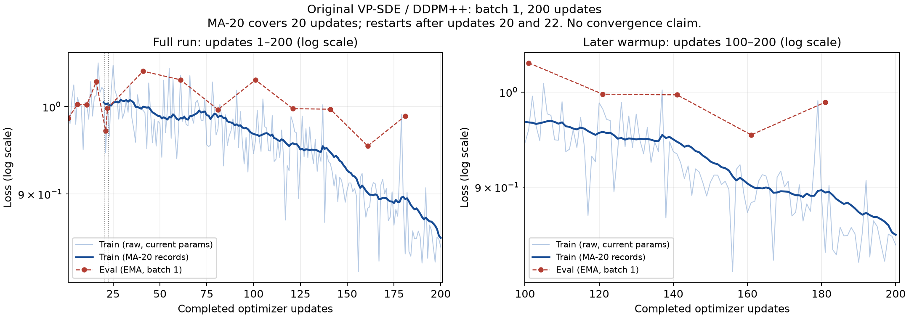

# Score-SDE small-scale reproduction: final report

Date: 2026-10-09. **The original-method software workflow is complete at small scale:** verified CIFAR-10 input, original-network training/evaluation, checkpoint saving, fresh-process Adam/EMA restoration, continuation to 200 updates, four original EMA samples, and a portable loss/evidence package. This is not reproduction of the teacher's 214k-step numerical performance or a converged image-generation result.

## Source and configuration

The teacher wrapper is pinned to `8c399ccd8079e5fe7e264f8a72ec97a598b33be1`; the original repository is pinned to `0acb9e0ea3b8cccd935068cd9c657318fbc6ce4c`. The online audit confirmed the teacher HEAD matched this pin on the audit date. All 19 wrapper files and 74 original files match their Git blobs. Both source trees remain unmodified.

The reference is continuous VP-SDE with DDPM++ architecture implemented by the original `ncsnpp` module: width 128, four residual blocks per level, original attention/channel settings, denoising score-matching objective, Adam, base learning rate 0.0002, 5,000-update warmup, gradient clipping and EMA 0.9999. Only batch size, iteration grouping/budget, output frequencies and automatic snapshot sampling differ. Full configurations are stored in the stage records; [the configuration audit](evidence-audit.json) verifies the allowed differences.

- [Full source/workflow correspondence](source-alignment.md), [93-file map](source-file-map.csv), [source audit](source-audit.json).
- [Exact local configurations](../../../configs/local/score-sde/), [environment lock](../../../environments/score-sde/requirements-lock.txt), [setup guide](../../../environments/score-sde/README.md).
- [Reproduction script index](../../../scripts/reproduction/README.md).

The environment is CPython 3.12.14, JAX/jaxlib 0.4.30, Flax 0.8.5, TensorFlow 2.21.0, NumPy 1.26.4 and Protobuf 6.33.5, validated on macOS ARM64 CPU. It is not a tested Linux/CUDA environment lock.

## Data and completed workflow

Official CIFAR-10 was downloaded with checksum validation. TFDS cifar10/3.0.2 contains 50,000 training and 10,000 test images. All examples were checked for uint8 shape 32 by 32 by 3 and balanced class counts. Original loader output was `[1,1,1,32,32,3]`; the network receives `[1,32,32,3]` float32 data centered to [-1,1].

| Stage | Completed evidence |
| --- | --- |
| Environment | Imports, devices and historical reduced-network synthetic checks passed |
| Data | Full real-data checks and unchanged original loader passed |
| Fresh original training | 20 updates and four finite validation observations |
| Restart/continuation | Full typed state restored at 20; Adam/EMA continued to 22; another interpreter restored the saved state |
| CPU benchmark | Another 178 updates to cumulative 200; eight finite validation observations; final and preemption state readback passed |
| Original EMA sampling | Four batch-one calls, finite outputs, correct shape, readable PNGs, unchanged complete training state |
| Final evidence export | 200 training and 14 validation records merged from byte-identical published TensorBoard streams; JSON cross-check and NPZ roundtrip passed |

Supporting stage reports: [data](data-preparation.md), [20 updates](original-20-updates.md), [resume](resume-check.md), [200 updates](original-200-updates.md), [sampling](sampling-check.md).

## Loss results and figures



The two views show completed updates 1–200 and 100–200. Both use log loss axes, raw training observations, a trailing 20-record mean and unsmoothed validation observations. Restarts occurred after updates 20 and 22. The late view is still warmup, not a convergence phase.

| Measurement | Value |
| --- | ---: |
| Training observations | 200 |
| Validation observations | 14 |
| Minimum training loss | 0.819385 at completed update 156 |
| Minimum validation loss | 0.953591 at completed update 161 |
| Final training loss | 0.844115 at completed update 200 |
| Last validation loss | 0.988733 at completed update 181 |

The data use the teacher's unchanged `plot_loss.extract_losses` reader. NPZ fields are exactly `train_steps`, `train_losses`, `eval_steps`, `eval_losses`, preserving original loop labels 0–199. CSV adds stage and completed update (`loop_step + 1`). Our MA-20 spans 20 updates; teacher reference data log every 50 labels, so their MA-20 spans approximately 1,000 updates. The original 5k+ right panel is inapplicable here.

The original training loss uses current optimizer parameters with training mode enabled; evaluation and sampling use EMA parameters in evaluation mode. These curves therefore do not compare the same parameter set. With EMA 0.9999, its initialization term retains approximately 98% weight after 200 updates, so a lagging validation curve and poor EMA samples are unsurprising at this stage. This is an explanation consistent with the method, not a proof that later training will succeed.

The decreasing training moving average does not establish convergence. Validation is sparse, batch size is one, and validation sampling/preprocessing is stochastic. The last train/eval observations are from different updates; no same-update final ratio or “No overfitting” status is reported. Train-mode validation uses the original CIFAR-10 test split, not an untouched final scientific test set.

- [Individual full view](../../../results/score-sde/final-summary/loss-full.png), [individual late view](../../../results/score-sde/final-summary/loss-late.png).
- [Teacher-compatible NPZ](../../../results/score-sde/final-summary/loss_history.npz), [CSV with provenance](../../../results/score-sde/final-summary/loss_history.csv), [loss summary](../../../results/score-sde/final-summary/summary.json).

## Runtime and memory

| Invocation | Update range | Measured seconds | Peak process RSS |
| --- | --- | ---: | ---: |
| Original fresh check | 0 → 20 | 198.81 | 5.63 GiB |
| Typed restart/continuation | 20 → 22 | 133.27 | 4.32 GiB |
| Continuation/benchmark | 22 → 200 | 908.09 | 4.37 GiB |
| Four EMA samples | remains 200 | 357.70 | 3.18 GiB |

These are individual invocation measurements, not total project time. Installation, downloads, interpreter imports, separate verification interpreters, unsuccessful diagnostic attempts, final export/audits and manual work are excluded. Data-preparation timing in its record is a reused-dataset validation call, not the original download duration. RSS excludes other processes and total system pressure.

The 200-update benchmark's first training call took 103.61 seconds including compilation. Last-100-update median training time was 4.51 seconds, with 90th percentile 4.72 seconds. Later-window median was 8.3% slower than the earlier window. First validation was 6.75 seconds; later validation median was 0.153 seconds; checkpoint calls totaled 7.06 seconds. These call timings are subsets of the full invocation and must not be added to it a second time.

The first sampler call took 85.24 seconds including any compilation. Three subsequent calls took 87.90, 88.97 and 90.48 seconds (median 88.97). This is a preliminary warm sampling-speed estimate. The cold/warm difference does not isolate compile time, and timing drift alone does not identify thermal throttling.

See [runtime CSV](../../../results/score-sde/final-summary/runtime-summary.csv), [runtime scopes](../../../results/score-sde/final-summary/runtime-summary.json), [per-training-call timings](../../../results/score-sde/original-200-updates/timings.csv), [training speed curve](../../../results/score-sde/original-200-updates/training-speed.png).

## Restoration and sampling evidence

Final regular and preemption checkpoints both restore to `state.step=200` and Adam count 200. All saved-state field hashes match after typed readback in another interpreter, including EMA, optimizer moments, model parameters and RNG. Checkpoint naming uses actual update counts; an external runner adaptation prevents final-name collisions and ensures automatic continuation starts from the final state.

Sampling uses `params_ema` and the original Euler–Maruyama VP-SDE sampler with no corrector, 1,000 reverse iterations, epsilon 0.001 and final predictor mean output. The upstream generic counter returns 2000, while the actual predictor-only score evaluations are 1000. Shapes are `[1,1,32,32,3]`, float32, finite. Complete training-state hashes are unchanged after sampling.

Raw arrays are small and committed alongside PNG previews and artifact hashes. Approximately 99% of RGB components fall outside the display range; clipped images look like saturated colored noise. This is a successful functionality check, not proof of effective denoising or realistic generation.

- [Restoration record](resume-validation.json), [final state verification](original-200-updates-validation.json), [checkpoint manifest](../../../results/manifests/score-sde-original-200-updates.json).
- [Sampling record](sampling-validation.json), [raw arrays and previews](../../../results/score-sde/original-200-sampling/).

Large checkpoints and datasets remain local and are not distributed through ordinary Git. A fresh clone can reproduce loss figures from the published events, but model execution/readback still requires the registered local checkpoints or equivalent externally provided artifacts.

## Issues and limitations

The [issue ledger](../../../results/score-sde/final-summary/issues.csv) separates resolved dependency decisions, diagnostic-format issues, accounted-for implementation conventions and remaining scientific limits.

Resolved/adapted items include Protobuf/TFDS metadata compatibility, Python/ML Collections and setuptools/TF Hub dependencies, the unused legacy TF-GAN Estimator import, optional GCS probing, Orbax representation normalization and shortened-run checkpoint naming. Some early installation/diagnostic exception logs were not retained; those entries are explicitly labeled as documented diagnoses/session-history notes rather than raw-log evidence. No failed diagnostic attempt is included in the 200-update loss sequence.

Remaining limits include early warmup and poor samples, batch-one validation noise, no exact uninterrupted-data/RNG replay, no long-duration hardware characterization, no full standard FID/IS/KID/likelihood evaluation, and no reproduction of the teacher's 214k training result. The teacher's random-weight Inception helper is fully preserved but not a standard pretrained metric reference.

## Portable evidence and regeneration

Nine completed-stage text logs are published with repository/workspace/home/hostname normalization. Original and normalized hashes are indexed; original local logs are unchanged. Three TensorBoard streams are copied byte for byte with portable file names, and their hashes are checked before plotting.

- [Evidence/log index](../../../results/score-sde/final-summary/evidence-index.json), [normalized logs](../../../results/score-sde/final-summary/logs/), [published events](../../../results/score-sde/final-summary/evidence/).
- [Source and stage evidence audit](evidence-audit.json), [final publication checks and file hashes](../../../results/score-sde/final-summary/publication-manifest.json).

From a recursive clone with the locked environment, regenerate figures and exports without training, sampling, CIFAR-10 or checkpoint access:

```bash
environments/score-sde/.venv/bin/python scripts/reproduction/export-score-sde-results.py
```

On the original machine, `--publish-local-evidence` refreshes portable copies from preserved local runs. This command does not execute model inference or training. The export verifies all three loss streams against stage JSON and rereads the four-field NPZ.

The next research component can proceed using this completed small-scale workflow as the software baseline. Larger training and standard numerical evaluation belong to a separate experiment with appropriate computing resources.
