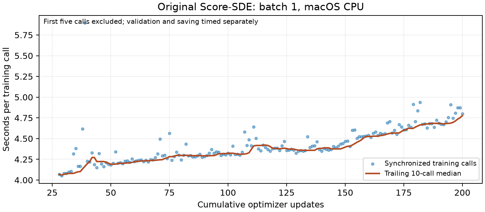

# Original-network continuation to 200 updates and CPU speed benchmark

Executed on 2026-10-09 using one macOS ARM64 JAX CPU device. The original network and method are preserved. This run establishes a short-run speed estimate and working state continuation, not convergence or paper-level numerical reproduction.

## Outcome

The verified update-22 preemption checkpoint was copied to a new experiment directory. Its complete typed state matched the earlier restoration record, including Adam and EMA. The unmodified original training function completed another **178 updates**, reaching **200 total**, and executed **eight finite validation batches**. All 178 training losses were finite. Snapshot sampling remained disabled.

The training invocation took **908.09 seconds (15 minutes 8 seconds)**, including setup, compilation, input processing, logging, validation, and checkpoint writes. Interpreter imports and subsequent analysis/readback are outside that invocation. Peak training-process RSS was **4.37 GiB**, excluding other processes and total system pressure. No out-of-memory or numerical failure occurred.

Both final and automatic-continuation checkpoints were read in a fresh interpreter into a reconstructed typed state. All fields matched their saved-state hashes, including model parameters, Adam moments/counter, EMA, RNG and scalar settings. The update count and Adam count were both 200. Final artifact checksums are recorded separately.

## Measured speed

Each training/evaluation `pmap` call was timed with wall-clock time and its outputs explicitly blocked until ready. Training-call measurements exclude data fetching, host logging, validation and checkpoint writing. Full invocation and log-to-log intervals capture those other costs.

| Segment | Calls | Median seconds per training call | 90th percentile |
| --- | ---: | ---: | ---: |
| Compiled calls, excluding the first five | 173 | 4.37 | 4.68 |
| Updates 50–99 | 50 | 4.28 | 4.34 |
| Updates 100–149 | 50 | 4.38 | 4.47 |
| Updates 150–200 | 51 | 4.64 | 4.84 |
| Last 100 updates (101–200) | 100 | **4.51** | **4.72** |

The first training call took **103.61 seconds**, including initial compilation and execution. First validation took **6.75 seconds**; subsequent validation calls had a median of **0.153 seconds**. Checkpoint calls totaled **7.06 seconds**. These isolated call timings do not include all host or filesystem bookkeeping.

The late-window median was **8.3% longer** than the 50–99 window. This is evidence of a modest timing drift during this run; it does not identify its cause. No temperature or CPU-clock telemetry was collected, so do not label it proven thermal throttling.

For another small local run with this same configuration, **approximately 4.5–5 seconds per update plus startup and periodic output overhead** is a more useful preliminary planning range than the earliest 4.1-second observation. Longer runs or different workloads require new measurement.



## Scientific interpretation

Training losses ranged from 0.819385 to 1.051192; the final training loss was 0.844115. Validation losses ranged from 0.953591 to 1.043591. These noisy batch-one observations do not establish convergence or image quality. The original 5,000-update warmup remains active at update 200. No generated-image, FID, likelihood or gravitational-wave inference result is claimed.

The upstream training-mode validation uses the CIFAR-10 test split with its original preprocessing. This is not a separate untouched final scientific test.

## Configuration and external instrumentation

The configuration derives from the pinned original `configs/vp/cifar10_ddpmpp_continuous.py`. Network width 128, four residual blocks per level, continuous VP-SDE, denoising objective, Adam, learning rate 0.0002, gradient clipping, 5,000-update warmup and EMA 0.9999 are unchanged.

Project-owned changes are batch size one, one jitted update, `n_iters=199`, per-update logs, evaluation frequency 20, checkpoint frequencies 50, and disabled snapshot sampling. The original loop includes its endpoint and triggers periodic output using its zero-based label: validation here ran at actual updates 41, 61, 81, 101, 121, 141, 161 and 181; periodic saves occurred at actual updates 51, 101 and 151.

Only external diagnostic wrappers were added around original checkpoint and `pmap` calls. Checkpoint file names use actual `state.step` instead of the original quotient-based index. This prevents the final save at label 199 from colliding with the periodic save at label 150. A final preemption checkpoint is also saved at actual update 200 so automatic continuation starts there. The teacher wrapper's existing retention cap keeps two regular checkpoints; older ones may be removed.

The latest saved directories are:

```text
runs/score-sde/original-200-updates/checkpoints/checkpoint_200
runs/score-sde/original-200-updates/checkpoints-meta/checkpoint_200
```

The original 20-update and 22-update runs remain preserved. The new experiment occupies approximately 2.8 GiB locally. Raw checkpoints and TensorBoard events are ignored by Git; small timing records, summaries, the figure and checksum manifests are versioned.

## Reproduce

From the repository root with the installed locked environment, prepared CIFAR-10, and verified update-22 source checkpoint:

```bash
environments/score-sde/.venv/bin/python -u scripts/reproduction/benchmark-score-sde-200.py \
  > runs/score-sde/original-200-updates.log 2>&1
environments/score-sde/.venv/bin/python -u scripts/reproduction/analyze-score-sde-200.py \
  > runs/score-sde/original-200-analysis.log 2>&1
```

The first script refuses to reuse an existing experiment directory. Preserve or rename existing output before repeating. Analysis must follow successful training and performs no optimizer updates. Restarting does not guarantee the identical uninterrupted trajectory because upstream does not persist the data iterator state and folds its saved RNG again at startup.

- [Configuration](../../../configs/local/score-sde/cifar10-original-200-updates.py)
- [Training and instrumentation](../../../scripts/reproduction/benchmark-score-sde-200.py)
- [Readback and analysis](../../../scripts/reproduction/analyze-score-sde-200.py)
- [Complete validation record](original-200-updates-validation.json)
- [Per-call timing CSV](../../../results/score-sde/original-200-updates/timings.csv)
- [Compact results](../../../results/score-sde/original-200-updates/summary.json)
- [Checkpoint artifact manifest](../../../results/manifests/score-sde-original-200-updates.json)
