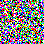

# Original EMA sampling from update 200

Executed on 2026-10-09 on one macOS ARM64 JAX CPU device. Four complete original-sampler calls ran in the same interpreter, each with batch size one and a different seed. No training updates were performed.

## Outcome

The complete typed update-200 checkpoint matched the preceding benchmark record. The original sampler uses `params_ema`, not the current optimizer parameters. Each output had shape `[1,1,32,32,3]`, dtype float32 and only finite values. RGB PNGs were successfully written and reopened at 32 by 32 pixels.

After all four calls, serialized hashes for every model/optimizer/EMA/RNG/scalar field still matched the loaded checkpoint; the update count remains **200**. No memory error occurred. Peak sampling-process RSS was **3.18 GiB** (not total machine memory pressure). The whole instrumented invocation took **357.70 seconds**, excluding interpreter imports and later documentation/publication.

## Timing and raw values

| Call | Seed | Complete sampler seconds | Unclipped inverse-scaled range | RGB-component clipping fraction |
| --- | ---: | ---: | --- | ---: |
| 1 | 1001 | 85.24 | -356.59 to 390.71 | 99.77% |
| 2 | 1002 | 87.90 | -400.30 to 397.49 | 99.38% |
| 3 | 1003 | 88.97 | -398.51 to 346.39 | 99.58% |
| 4 | 1004 | 90.48 | -392.33 to 328.04 | 99.54% |

The first call includes any compilation needed by the sampler. Calls 2–4 reuse the same function and shapes. Their median is **88.97 seconds per image**, mean **89.11 seconds**, and range **87.90–90.48 seconds**.

All sampler outputs were blocked until ready before stopping the timer. Image encoding, saving and artifact copying are excluded from per-call timings. The first call happened to be faster than the later calls; do not subtract these timings to claim a compilation duration. Three warm calls support a preliminary local sampling-speed estimate, not a sustained benchmark or a precise tail estimate.

## Method preserved

The original network, trained state and sampler are unchanged: continuous VP-SDE, Euler–Maruyama predictor, no corrector, probability flow disabled, noise removal enabled, 1,000 reverse iterations and integration endpoint epsilon 0.001. No accelerated sampler, reduced reverse-step count, clipping inside the dynamics, or additional training was introduced.

The upstream function returns the generic counter `N * (n_steps_each + 1) = 2000`. Under this configuration, `NoneCorrector` performs no score evaluation and Euler–Maruyama evaluates the score once per iteration, so the actual model/score evaluation count is **1000 per image**. The final noise-removal option returns the last predictor mean and does not add another score call. Both the returned counter and actual count are recorded without modifying upstream code.

## What the images mean

The generated arrays are finite but have large ranges and approximately 99% of RGB components lie outside [0,1]. Saved PNGs clip these values to [0,1] and map them to uint8, matching the original display convention. The previews therefore look like saturated colored noise. Their successful creation does **not** demonstrate effective denoising or realistic CIFAR-10 generation.

The 200-update model is still in the early portion of its original 5,000-update learning-rate warmup, and its EMA has not undergone enough training to establish image quality. The present success criterion is the working checkpoint-to-EMA-to-reverse-sampling-to-artifact pipeline. Raw arrays are preserved so display clipping cannot hide their behavior. Do not interpret finite values alone as evidence that the learned reverse process is accurate.

The 2 by 2 contact sheet orders seeds 1001, 1002, 1003, 1004 from left to right and top to bottom. It is a native 64 by 64 display image:



## Reproduce and inspect

From the repository root, with the locked environment and local update-200 checkpoint:

```bash
environments/score-sde/.venv/bin/python -u scripts/reproduction/check-score-sde-sampling.py \
  > runs/score-sde/original-200-sampling.log 2>&1
```

The script refuses to overwrite an existing report. Preserve or rename an existing output directory before repeating. It calls the original sampling function directly, so the training configuration's disabled automatic snapshot sampling does not prevent this explicit sampling check.

- [Sampling and diagnostic script](../../../scripts/reproduction/check-score-sde-sampling.py)
- [Full validation record](sampling-validation.json)
- [Versioned raw arrays, individual PNGs and summary](../../../results/score-sde/original-200-sampling/)

Raw samples are small (12 KiB of float data per image) and intentionally versioned alongside the previews and hashes. Large model checkpoints remain local and excluded from Git. Both upstream source repositories remain unmodified.
